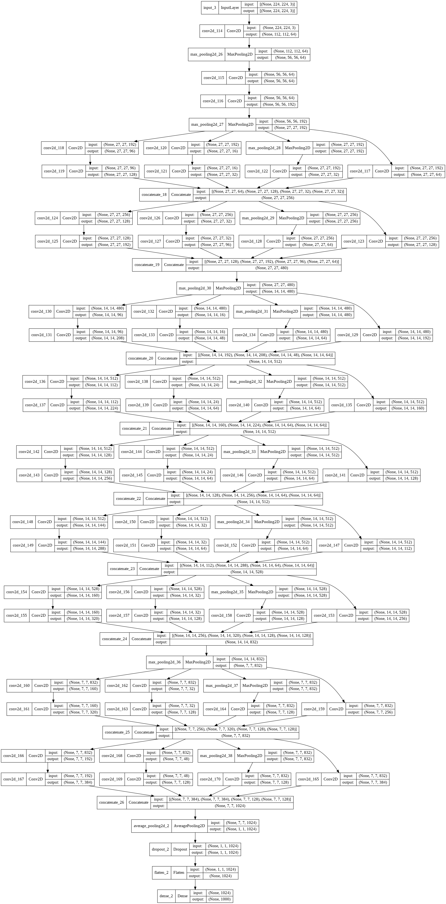

## Implementation of GoogLeNet

We will use the [tensorflow.keras Functional API](https://www.tensorflow.org/guide/keras/functional) to build GoogLeNet from the original paper: “[Going Deeper with Convolutions](https://arxiv.org/abs/1409.4842)” by Christian Szegedy, Wei Liu, Yangqing Jia, Pierre Sermanet, Scott Reed, Dragomir Anguelov, Dumitru Erhan, Vincent Vanhoucke, Andrew Rabinovich.

[Video tutorial](https://www.youtube.com/watch?v=fq2srEX7VV0&list=PLaPdEEY26UXyE3UchW0C742xh542yh0yI&index=3)

---

In the paper we can read:

>**[i]** “All the convolutions, including those inside the Inception modules, use rectified linear activation”

<br>

We will also use the following Table **[ii]**:


<br>

as well the following Diagram **[iii]** of the Inception block:


---

## Network architecture

In GoogleNet starts with two Conv-MaxPool blocks and then continues with a series of **Inception** blocks separated by *Max Pool* layers before the fineal *Fully Connected* layer.

### Inception block

The Inception block is depicted at **[iii]**.

It takes as input a tensor and passes it through **4 different streams**:
1. a 1x1 Conv layer
2. a 1x1 Conv layer followed by a 3x3 Conv layer
3. a 1x1 Conv layer followed by a 5x5 Conv layer
4. a 3x3 Max Pool layer followed by a 1x1 Conv layer

The output tensors of all four final Conv layers are **concatenated** to one tensor.

---

## Workflow
We will:
1. import the neccesary layers
2. write a helper function for the inception_block()
3. test inception_block()
4. write the code for the stem of the model
5. write the code for the main part (Inception blocks) of the model

---

### 1. Imports


```python
from tensorflow.keras.layers import Input, Conv2D, MaxPool2D,Concatenate, AvgPool2D, Dropout, Flatten, Dense
```

### 2. inception_block()
Next, we will build the *Inception block* as a function that will:
- take as inputs:
  - a tensor (**`x`**)
  - a list with the number of filters for each one of the 6 Convolutional layers of an Inception block (**`filters`**)
- run:
    - apply the structure of *Inception block* as described above
- return the tensor

and will return the concatenaded tensor **`output`**.


```python
def inception_block(x, filters):
    t1 = Conv2D(filters=filters[0], kernel_size=1, activation='relu')(x)

    t2 = Conv2D(filters=filters[1], kernel_size=1, activation='relu')(x)
    t2 = Conv2D(filters=filters[2], kernel_size=3, padding='same', activation='relu')(t2)

    t3 = Conv2D(filters=filters[3], kernel_size=1, activation='relu')(x)
    t3 = Conv2D(filters=filters[4], kernel_size=5, padding='same', activation='relu')(t3)

    t4 = MaxPool2D(pool_size=3, strides=1, padding='same')(x)
    t4 = Conv2D(filters=filters[5], kernel_size=1, activation='relu')(t4)

    output = Concatenate()([t1, t2, t3, t4])
    return output

```

### 3. Stem of the model
#### Part 1

From the *Table*:


| type        	|  patch size / stride 	| output size |
|-------------	|:--------------------:	|:-----------:|
| convolution 	|        7x7 / 2       	| 112x112x64  |
| max pool    	|        3x3 / 2       	| 56x56x64    


```python
input = Input(shape=(224, 224, 3))
x = Conv2D(filters=64, kernel_size=7, strides=2, padding='same', activation='relu')(input)
x = MaxPool2D(pool_size=3, strides=2, padding='same')(x)
```

#### Part 2

From the *Table*:


| type        	|  patch size / stride 	| #3x3 reduce 	| #3x3 	|
|-------------	|:--------------------:	|:-----------:	|:----:	|
| convolution 	|        3x3 / 1       	| 64          	| 192  	|
| max pool    	|        3x3 / 2       	|             	|      	|


```python
x = Conv2D(filters=64, kernel_size=1, activation='relu')(x)
x = Conv2D(filters=192, kernel_size=3, padding='same', activation='relu')(x)
x = MaxPool2D(pool_size=3, strides=2)(x)
```

### 4. Main part of the model

#### Part 3
From the *Table*:


| type          	|  patch size / stride 	| #1x1 	| #3x3 reduce 	| #3x3 	| #5x5 reduce 	| #5x5 	| pool proj 	|
|---------------	|:--------------------:	|:----:	|:-----------:	|:----:	|:-----------:	|:----:	|:---------:	|
| inception(3a) 	|                      	| 64   	| 96          	| 128  	| 16          	| 32   	| 32        	|
| inception(3b) 	|                      	| 128  	| 128         	| 192  	| 32          	| 96   	| 64        	|
| max pool      	|        3x3 / 2       	|      	|             	|      	|             	|      	|           	|


```python
x = inception_block(x, filters=[64, 96, 128, 16, 32, 32])
x = inception_block(x, filters=[128, 128, 192, 32, 96, 64])
x = MaxPool2D(pool_size=3, strides=2, padding='same')(x)
```

#### Part 4
From the *Table*:


| type          	|  patch size / stride 	| #1x1 	| #3x3 reduce 	| #3x3 	| #5x5 reduce 	| #5x5 	| pool proj 	|
|---------------	|:--------------------:	|:----:	|:-----------:	|:----:	|:-----------:	|:----:	|:---------:	|
| inception(4a) 	|                      	| 192  	| 96          	| 208  	| 16          	| 48   	| 64        	|
| inception(4b) 	|                      	| 160  	| 112         	| 224  	| 24          	| 64   	| 64        	|
| inception(4c) 	|                      	| 128  	| 128         	| 256  	| 24          	| 64   	| 64        	|
| inception(4d) 	|                      	| 112  	| 144         	| 288  	| 32          	| 64   	| 64        	|
| inception(4e) 	|                      	| 256  	| 160         	| 320  	| 32          	| 128  	| 128       	|
| max pool      	|        3x3 / 2       	|      	|             	|      	|             	|      	|           	|


```python
x = inception_block(x, filters=[192, 96, 208, 16, 48, 64])
x = inception_block(x, filters=[160, 112, 224, 24, 64, 64])
x = inception_block(x, filters=[128, 128, 256, 24, 64, 64])
x = inception_block(x, filters=[112, 144, 288, 32, 64, 64])
x = inception_block(x, filters=[256, 160, 320, 32, 128, 128])
x = MaxPool2D(pool_size=3, strides=2, padding='same')(x)
```

#### Part 5
From the *Table*:


| type          	|  patch size / stride 	| #1x1 	| #3x3 reduce 	| #3x3 	| #5x5 reduce 	| #5x5 	| pool proj 	|
|---------------	|:--------------------:	|:----:	|:-----------:	|:----:	|:-----------:	|:----:	|:---------:	|
| inception(5a) 	|                      	| 256  	| 160         	| 320  	| 32          	| 128  	| 128       	|
| inception(5b) 	|                      	| 384  	| 192         	| 384  	| 48          	| 128  	| 128       	|
| avg pool      	|        7x7 / 1       	|      	|             	|      	|             	|      	|           	|
| dropout(40%)  	|                      	|      	|             	|      	|             	|      	|           	|
| linear        	|                      	|      	|             	|      	|             	|      	|           	|
| softmax       	|                      	|      	|             	|      	|             	|      	|           	|


```python
x = inception_block(x, filters=[256, 160, 320, 32, 128, 128])
x = inception_block(x, filters=[384, 192, 384, 48, 128, 128])
x = AvgPool2D(pool_size=7, strides=1)(x)
x = Dropout(rate=0.4)(x)

x = Flatten()(x)
output = Dense(units=1000, activation='softmax')(x)
```

### Model definition


```python
from tensorflow.keras import Model

model = Model(inputs=input, outputs=output)
```


```python

```

## Final code


```python
from tensorflow.keras.layers import Input, Conv2D, MaxPool2D, \
     Concatenate, AvgPool2D, Dropout, Flatten, Dense
      
def inception_block(x, filters):
    t1 = Conv2D(filters=filters[0], kernel_size=1, activation='relu')(x)

    t2 = Conv2D(filters=filters[1], kernel_size=1, activation='relu')(x)
    t2 = Conv2D(filters=filters[2], kernel_size=3, padding='same', activation='relu')(t2)

    t3 = Conv2D(filters=filters[3], kernel_size=1, activation='relu')(x)
    t3 = Conv2D(filters=filters[4], kernel_size=5, padding='same', activation='relu')(t3)

    t4 = MaxPool2D(pool_size=3, strides=1, padding='same')(x)
    t4 = Conv2D(filters=filters[5], kernel_size=1, activation='relu')(t4)

    output = Concatenate()([t1, t2, t3, t4])
    return output


input = Input(shape=(224, 224, 3))
x = Conv2D(filters=64, kernel_size=7, strides=2, padding='same', activation='relu')(input)
x = MaxPool2D(pool_size=3, strides=2, padding='same')(x)

x = Conv2D(filters=64, kernel_size=1, activation='relu')(x)
x = Conv2D(filters=192, kernel_size=3, padding='same', activation='relu')(x)
x = MaxPool2D(pool_size=3, strides=2)(x)

x = inception_block(x, filters=[64, 96, 128, 16, 32, 32])
x = inception_block(x, filters=[128, 128, 192, 32, 96, 64])
x = MaxPool2D(pool_size=3, strides=2, padding='same')(x)

x = inception_block(x, filters=[192, 96, 208, 16, 48, 64])
x = inception_block(x, filters=[160, 112, 224, 24, 64, 64])
x = inception_block(x, filters=[128, 128, 256, 24, 64, 64])
x = inception_block(x, filters=[112, 144, 288, 32, 64, 64])
x = inception_block(x, filters=[256, 160, 320, 32, 128, 128])
x = MaxPool2D(pool_size=3, strides=2, padding='same')(x)

x = inception_block(x, filters=[256, 160, 320, 32, 128, 128])
x = inception_block(x, filters=[384, 192, 384, 48, 128, 128])
x = AvgPool2D(pool_size=7, strides=1)(x)
x = Dropout(rate=0.4)(x)

x = Flatten()(x)
output = Dense(units=1000, activation='softmax')(x)

from tensorflow.keras import Model

model = Model(inputs=input, outputs=output)
model.summary()
```

    Model: "model_2"
    __________________________________________________________________________________________________
     Layer (type)                   Output Shape         Param #     Connected to                     
    ==================================================================================================
     input_3 (InputLayer)           [(None, 224, 224, 3  0           []                               
                                    )]                                                                
                                                                                                      
     conv2d_114 (Conv2D)            (None, 112, 112, 64  9472        ['input_3[0][0]']                
                                    )                                                                 
                                                                                                      
     max_pooling2d_26 (MaxPooling2D  (None, 56, 56, 64)  0           ['conv2d_114[0][0]']             
     )                                                                                                
                                                                                                      
     conv2d_115 (Conv2D)            (None, 56, 56, 64)   4160        ['max_pooling2d_26[0][0]']       
                                                                                                      
     conv2d_116 (Conv2D)            (None, 56, 56, 192)  110784      ['conv2d_115[0][0]']             
                                                                                                      
     max_pooling2d_27 (MaxPooling2D  (None, 27, 27, 192)  0          ['conv2d_116[0][0]']             
     )                                                                                                
                                                                                                      
     conv2d_118 (Conv2D)            (None, 27, 27, 96)   18528       ['max_pooling2d_27[0][0]']       
                                                                                                      
     conv2d_120 (Conv2D)            (None, 27, 27, 16)   3088        ['max_pooling2d_27[0][0]']       
                                                                                                      
     max_pooling2d_28 (MaxPooling2D  (None, 27, 27, 192)  0          ['max_pooling2d_27[0][0]']       
     )                                                                                                
                                                                                                      
     conv2d_117 (Conv2D)            (None, 27, 27, 64)   12352       ['max_pooling2d_27[0][0]']       
                                                                                                      
     conv2d_119 (Conv2D)            (None, 27, 27, 128)  110720      ['conv2d_118[0][0]']             
                                                                                                      
     conv2d_121 (Conv2D)            (None, 27, 27, 32)   12832       ['conv2d_120[0][0]']             
                                                                                                      
     conv2d_122 (Conv2D)            (None, 27, 27, 32)   6176        ['max_pooling2d_28[0][0]']       
                                                                                                      
     concatenate_18 (Concatenate)   (None, 27, 27, 256)  0           ['conv2d_117[0][0]',             
                                                                      'conv2d_119[0][0]',             
                                                                      'conv2d_121[0][0]',             
                                                                      'conv2d_122[0][0]']             
                                                                                                      
     conv2d_124 (Conv2D)            (None, 27, 27, 128)  32896       ['concatenate_18[0][0]']         
                                                                                                      
     conv2d_126 (Conv2D)            (None, 27, 27, 32)   8224        ['concatenate_18[0][0]']         
                                                                                                      
     max_pooling2d_29 (MaxPooling2D  (None, 27, 27, 256)  0          ['concatenate_18[0][0]']         
     )                                                                                                
                                                                                                      
     conv2d_123 (Conv2D)            (None, 27, 27, 128)  32896       ['concatenate_18[0][0]']         
                                                                                                      
     conv2d_125 (Conv2D)            (None, 27, 27, 192)  221376      ['conv2d_124[0][0]']             
                                                                                                      
     conv2d_127 (Conv2D)            (None, 27, 27, 96)   76896       ['conv2d_126[0][0]']             
                                                                                                      
     conv2d_128 (Conv2D)            (None, 27, 27, 64)   16448       ['max_pooling2d_29[0][0]']       
                                                                                                      
     concatenate_19 (Concatenate)   (None, 27, 27, 480)  0           ['conv2d_123[0][0]',             
                                                                      'conv2d_125[0][0]',             
                                                                      'conv2d_127[0][0]',             
                                                                      'conv2d_128[0][0]']             
                                                                                                      
     max_pooling2d_30 (MaxPooling2D  (None, 14, 14, 480)  0          ['concatenate_19[0][0]']         
     )                                                                                                
                                                                                                      
     conv2d_130 (Conv2D)            (None, 14, 14, 96)   46176       ['max_pooling2d_30[0][0]']       
                                                                                                      
     conv2d_132 (Conv2D)            (None, 14, 14, 16)   7696        ['max_pooling2d_30[0][0]']       
                                                                                                      
     max_pooling2d_31 (MaxPooling2D  (None, 14, 14, 480)  0          ['max_pooling2d_30[0][0]']       
     )                                                                                                
                                                                                                      
     conv2d_129 (Conv2D)            (None, 14, 14, 192)  92352       ['max_pooling2d_30[0][0]']       
                                                                                                      
     conv2d_131 (Conv2D)            (None, 14, 14, 208)  179920      ['conv2d_130[0][0]']             
                                                                                                      
     conv2d_133 (Conv2D)            (None, 14, 14, 48)   19248       ['conv2d_132[0][0]']             
                                                                                                      
     conv2d_134 (Conv2D)            (None, 14, 14, 64)   30784       ['max_pooling2d_31[0][0]']       
                                                                                                      
     concatenate_20 (Concatenate)   (None, 14, 14, 512)  0           ['conv2d_129[0][0]',             
                                                                      'conv2d_131[0][0]',             
                                                                      'conv2d_133[0][0]',             
                                                                      'conv2d_134[0][0]']             
                                                                                                      
     conv2d_136 (Conv2D)            (None, 14, 14, 112)  57456       ['concatenate_20[0][0]']         
                                                                                                      
     conv2d_138 (Conv2D)            (None, 14, 14, 24)   12312       ['concatenate_20[0][0]']         
                                                                                                      
     max_pooling2d_32 (MaxPooling2D  (None, 14, 14, 512)  0          ['concatenate_20[0][0]']         
     )                                                                                                
                                                                                                      
     conv2d_135 (Conv2D)            (None, 14, 14, 160)  82080       ['concatenate_20[0][0]']         
                                                                                                      
     conv2d_137 (Conv2D)            (None, 14, 14, 224)  226016      ['conv2d_136[0][0]']             
                                                                                                      
     conv2d_139 (Conv2D)            (None, 14, 14, 64)   38464       ['conv2d_138[0][0]']             
                                                                                                      
     conv2d_140 (Conv2D)            (None, 14, 14, 64)   32832       ['max_pooling2d_32[0][0]']       
                                                                                                      
     concatenate_21 (Concatenate)   (None, 14, 14, 512)  0           ['conv2d_135[0][0]',             
                                                                      'conv2d_137[0][0]',             
                                                                      'conv2d_139[0][0]',             
                                                                      'conv2d_140[0][0]']             
                                                                                                      
     conv2d_142 (Conv2D)            (None, 14, 14, 128)  65664       ['concatenate_21[0][0]']         
                                                                                                      
     conv2d_144 (Conv2D)            (None, 14, 14, 24)   12312       ['concatenate_21[0][0]']         
                                                                                                      
     max_pooling2d_33 (MaxPooling2D  (None, 14, 14, 512)  0          ['concatenate_21[0][0]']         
     )                                                                                                
                                                                                                      
     conv2d_141 (Conv2D)            (None, 14, 14, 128)  65664       ['concatenate_21[0][0]']         
                                                                                                      
     conv2d_143 (Conv2D)            (None, 14, 14, 256)  295168      ['conv2d_142[0][0]']             
                                                                                                      
     conv2d_145 (Conv2D)            (None, 14, 14, 64)   38464       ['conv2d_144[0][0]']             
                                                                                                      
     conv2d_146 (Conv2D)            (None, 14, 14, 64)   32832       ['max_pooling2d_33[0][0]']       
                                                                                                      
     concatenate_22 (Concatenate)   (None, 14, 14, 512)  0           ['conv2d_141[0][0]',             
                                                                      'conv2d_143[0][0]',             
                                                                      'conv2d_145[0][0]',             
                                                                      'conv2d_146[0][0]']             
                                                                                                      
     conv2d_148 (Conv2D)            (None, 14, 14, 144)  73872       ['concatenate_22[0][0]']         
                                                                                                      
     conv2d_150 (Conv2D)            (None, 14, 14, 32)   16416       ['concatenate_22[0][0]']         
                                                                                                      
     max_pooling2d_34 (MaxPooling2D  (None, 14, 14, 512)  0          ['concatenate_22[0][0]']         
     )                                                                                                
                                                                                                      
     conv2d_147 (Conv2D)            (None, 14, 14, 112)  57456       ['concatenate_22[0][0]']         
                                                                                                      
     conv2d_149 (Conv2D)            (None, 14, 14, 288)  373536      ['conv2d_148[0][0]']             
                                                                                                      
     conv2d_151 (Conv2D)            (None, 14, 14, 64)   51264       ['conv2d_150[0][0]']             
                                                                                                      
     conv2d_152 (Conv2D)            (None, 14, 14, 64)   32832       ['max_pooling2d_34[0][0]']       
                                                                                                      
     concatenate_23 (Concatenate)   (None, 14, 14, 528)  0           ['conv2d_147[0][0]',             
                                                                      'conv2d_149[0][0]',             
                                                                      'conv2d_151[0][0]',             
                                                                      'conv2d_152[0][0]']             
                                                                                                      
     conv2d_154 (Conv2D)            (None, 14, 14, 160)  84640       ['concatenate_23[0][0]']         
                                                                                                      
     conv2d_156 (Conv2D)            (None, 14, 14, 32)   16928       ['concatenate_23[0][0]']         
                                                                                                      
     max_pooling2d_35 (MaxPooling2D  (None, 14, 14, 528)  0          ['concatenate_23[0][0]']         
     )                                                                                                
                                                                                                      
     conv2d_153 (Conv2D)            (None, 14, 14, 256)  135424      ['concatenate_23[0][0]']         
                                                                                                      
     conv2d_155 (Conv2D)            (None, 14, 14, 320)  461120      ['conv2d_154[0][0]']             
                                                                                                      
     conv2d_157 (Conv2D)            (None, 14, 14, 128)  102528      ['conv2d_156[0][0]']             
                                                                                                      
     conv2d_158 (Conv2D)            (None, 14, 14, 128)  67712       ['max_pooling2d_35[0][0]']       
                                                                                                      
     concatenate_24 (Concatenate)   (None, 14, 14, 832)  0           ['conv2d_153[0][0]',             
                                                                      'conv2d_155[0][0]',             
                                                                      'conv2d_157[0][0]',             
                                                                      'conv2d_158[0][0]']             
                                                                                                      
     max_pooling2d_36 (MaxPooling2D  (None, 7, 7, 832)   0           ['concatenate_24[0][0]']         
     )                                                                                                
                                                                                                      
     conv2d_160 (Conv2D)            (None, 7, 7, 160)    133280      ['max_pooling2d_36[0][0]']       
                                                                                                      
     conv2d_162 (Conv2D)            (None, 7, 7, 32)     26656       ['max_pooling2d_36[0][0]']       
                                                                                                      
     max_pooling2d_37 (MaxPooling2D  (None, 7, 7, 832)   0           ['max_pooling2d_36[0][0]']       
     )                                                                                                
                                                                                                      
     conv2d_159 (Conv2D)            (None, 7, 7, 256)    213248      ['max_pooling2d_36[0][0]']       
                                                                                                      
     conv2d_161 (Conv2D)            (None, 7, 7, 320)    461120      ['conv2d_160[0][0]']             
                                                                                                      
     conv2d_163 (Conv2D)            (None, 7, 7, 128)    102528      ['conv2d_162[0][0]']             
                                                                                                      
     conv2d_164 (Conv2D)            (None, 7, 7, 128)    106624      ['max_pooling2d_37[0][0]']       
                                                                                                      
     concatenate_25 (Concatenate)   (None, 7, 7, 832)    0           ['conv2d_159[0][0]',             
                                                                      'conv2d_161[0][0]',             
                                                                      'conv2d_163[0][0]',             
                                                                      'conv2d_164[0][0]']             
                                                                                                      
     conv2d_166 (Conv2D)            (None, 7, 7, 192)    159936      ['concatenate_25[0][0]']         
                                                                                                      
     conv2d_168 (Conv2D)            (None, 7, 7, 48)     39984       ['concatenate_25[0][0]']         
                                                                                                      
     max_pooling2d_38 (MaxPooling2D  (None, 7, 7, 832)   0           ['concatenate_25[0][0]']         
     )                                                                                                
                                                                                                      
     conv2d_165 (Conv2D)            (None, 7, 7, 384)    319872      ['concatenate_25[0][0]']         
                                                                                                      
     conv2d_167 (Conv2D)            (None, 7, 7, 384)    663936      ['conv2d_166[0][0]']             
                                                                                                      
     conv2d_169 (Conv2D)            (None, 7, 7, 128)    153728      ['conv2d_168[0][0]']             
                                                                                                      
     conv2d_170 (Conv2D)            (None, 7, 7, 128)    106624      ['max_pooling2d_38[0][0]']       
                                                                                                      
     concatenate_26 (Concatenate)   (None, 7, 7, 1024)   0           ['conv2d_165[0][0]',             
                                                                      'conv2d_167[0][0]',             
                                                                      'conv2d_169[0][0]',             
                                                                      'conv2d_170[0][0]']             
                                                                                                      
     average_pooling2d_2 (AveragePo  (None, 1, 1, 1024)  0           ['concatenate_26[0][0]']         
     oling2D)                                                                                         
                                                                                                      
     dropout_2 (Dropout)            (None, 1, 1, 1024)   0           ['average_pooling2d_2[0][0]']    
                                                                                                      
     flatten_2 (Flatten)            (None, 1024)         0           ['dropout_2[0][0]']              
                                                                                                      
     dense_2 (Dense)                (None, 1000)         1025000     ['flatten_2[0][0]']              
                                                                                                      
    ==================================================================================================
    Total params: 6,998,552
    Trainable params: 6,998,552
    Non-trainable params: 0
    __________________________________________________________________________________________________
    


```python
import tensorflow as tf
tf.keras.utils.plot_model(model, to_file="my_model.png", show_shapes=True)
```


    

    


```python

```
