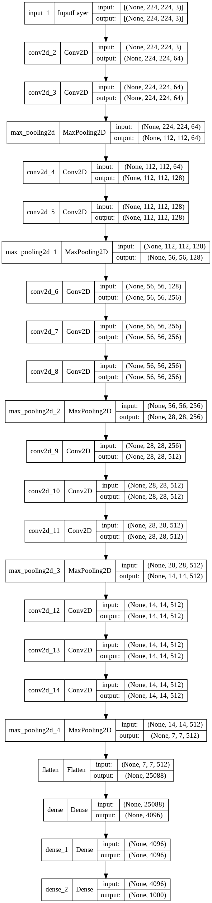

# Implementation of VGGNet

We will use the [tensorflow.keras Functional API](https://www.tensorflow.org/guide/keras/functional) to build VGGNet from the original paper: “[Very Deep Convolutional Networks for Large-Scale Image Recognition](https://arxiv.org/abs/1409.1556)” by Karen Simonyan, Andrew Zisserman.

---

In the paper we can read:

>**[i]** “All hidden layers are equipped with the rectification (ReLU (Krizhevsky et al., 2012)) non-linearity.”
>
>**[ii]** “Max-pooling is performed over a 2 × 2 pixel window, with stride 2.”

<br>

We will also use the following Table **[iii]**:


---

## Network architecture

- The network consists of 5 *Convolutional* blocks and 3 *Fully Connected* Layers

- Each Convolutional block consists of 2 or more Convolutional layers and a Max Pool layer

---

## Workflow
We will:
1. import the neccesary layers
2. write the code for the *Convolution blocks* 
3. write the code for the *Dense layers*
4. build the model

---

### 1. Imports


```python
from tensorflow.keras.layers import Input, Conv2D, MaxPool2D, Flatten, Dense
```

### 2. Defining the input layer


```python
input = Input(shape=(224,224,3))
```

### 3. Convolutional blocks


```python
# 1st set of blocks
x = Conv2D(filters=64,kernel_size=3, padding='same', activation='relu')(input)
x = Conv2D(filters=64,kernel_size=3, padding='same', activation='relu')(x)
x = MaxPool2D(pool_size=2,strides=2, padding='same')(x)
```


```python
# 2nd set of blocks
x = Conv2D(filters=128,kernel_size=3, padding='same', activation='relu')(x)
x = Conv2D(filters=128,kernel_size=3, padding='same', activation='relu')(x)
x = MaxPool2D(pool_size=2,strides=2, padding='same')(x)
```


```python
# 3rd set of blocks
x = Conv2D(filters=256,kernel_size=3, padding='same', activation='relu')(x)
x = Conv2D(filters=256,kernel_size=3, padding='same', activation='relu')(x)
x = Conv2D(filters=256,kernel_size=3, padding='same', activation='relu')(x)
x = MaxPool2D(pool_size=2,strides=2, padding='same')(x)
```


```python
# 4th set of blocks
x = Conv2D(filters=512,kernel_size=3, padding='same', activation='relu')(x)
x = Conv2D(filters=512,kernel_size=3, padding='same', activation='relu')(x)
x = Conv2D(filters=512,kernel_size=3, padding='same', activation='relu')(x)
x = MaxPool2D(pool_size=2,strides=2, padding='same')(x)
```


```python
# 5th set of blocks
x = Conv2D(filters=512,kernel_size=3, padding='same', activation='relu')(x)
x = Conv2D(filters=512,kernel_size=3, padding='same', activation='relu')(x)
x = Conv2D(filters=512,kernel_size=3, padding='same', activation='relu')(x)
x = MaxPool2D(pool_size=2,strides=2, padding='same')(x)
```


```python
x = Flatten()(x)
x = Dense(units=4096, activation = 'relu')(x)
x = Dense(units=4096, activation = 'relu')(x)
output = Dense(units=1000, activation = 'softmax')(x)
```

### 4.Model
In order to build the model we will use the tensorflow.keras.Model object:


```python
from tensorflow.keras import Model
model = Model(inputs=input, outputs=output)
model.summary()
```

    Model: "model_1"
    _________________________________________________________________
     Layer (type)                Output Shape              Param #   
    =================================================================
     input_1 (InputLayer)        [(None, 224, 224, 3)]     0         
                                                                     
     conv2d_2 (Conv2D)           (None, 224, 224, 64)      1792      
                                                                     
     conv2d_3 (Conv2D)           (None, 224, 224, 64)      36928     
                                                                     
     max_pooling2d (MaxPooling2D  (None, 112, 112, 64)     0         
     )                                                               
                                                                     
     conv2d_4 (Conv2D)           (None, 112, 112, 128)     73856     
                                                                     
     conv2d_5 (Conv2D)           (None, 112, 112, 128)     147584    
                                                                     
     max_pooling2d_1 (MaxPooling  (None, 56, 56, 128)      0         
     2D)                                                             
                                                                     
     conv2d_6 (Conv2D)           (None, 56, 56, 256)       295168    
                                                                     
     conv2d_7 (Conv2D)           (None, 56, 56, 256)       590080    
                                                                     
     conv2d_8 (Conv2D)           (None, 56, 56, 256)       590080    
                                                                     
     max_pooling2d_2 (MaxPooling  (None, 28, 28, 256)      0         
     2D)                                                             
                                                                     
     conv2d_9 (Conv2D)           (None, 28, 28, 512)       1180160   
                                                                     
     conv2d_10 (Conv2D)          (None, 28, 28, 512)       2359808   
                                                                     
     conv2d_11 (Conv2D)          (None, 28, 28, 512)       2359808   
                                                                     
     max_pooling2d_3 (MaxPooling  (None, 14, 14, 512)      0         
     2D)                                                             
                                                                     
     conv2d_12 (Conv2D)          (None, 14, 14, 512)       2359808   
                                                                     
     conv2d_13 (Conv2D)          (None, 14, 14, 512)       2359808   
                                                                     
     conv2d_14 (Conv2D)          (None, 14, 14, 512)       2359808   
                                                                     
     max_pooling2d_4 (MaxPooling  (None, 7, 7, 512)        0         
     2D)                                                             
                                                                     
     flatten (Flatten)           (None, 25088)             0         
                                                                     
     dense (Dense)               (None, 4096)              102764544 
                                                                     
     dense_1 (Dense)             (None, 4096)              16781312  
                                                                     
     dense_2 (Dense)             (None, 1000)              4097000   
                                                                     
    =================================================================
    Total params: 138,357,544
    Trainable params: 138,357,544
    Non-trainable params: 0
    _________________________________________________________________
    


```python
import tensorflow as tf
tf.keras.utils.plot_model(model, to_file="my_model.png", show_shapes=True)
```


    

    


```python

```
